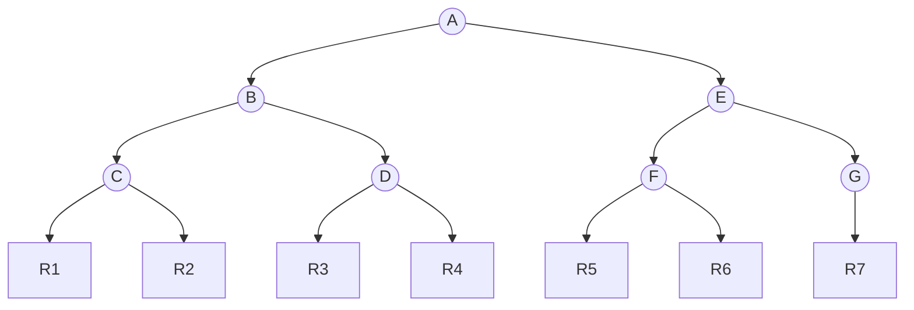
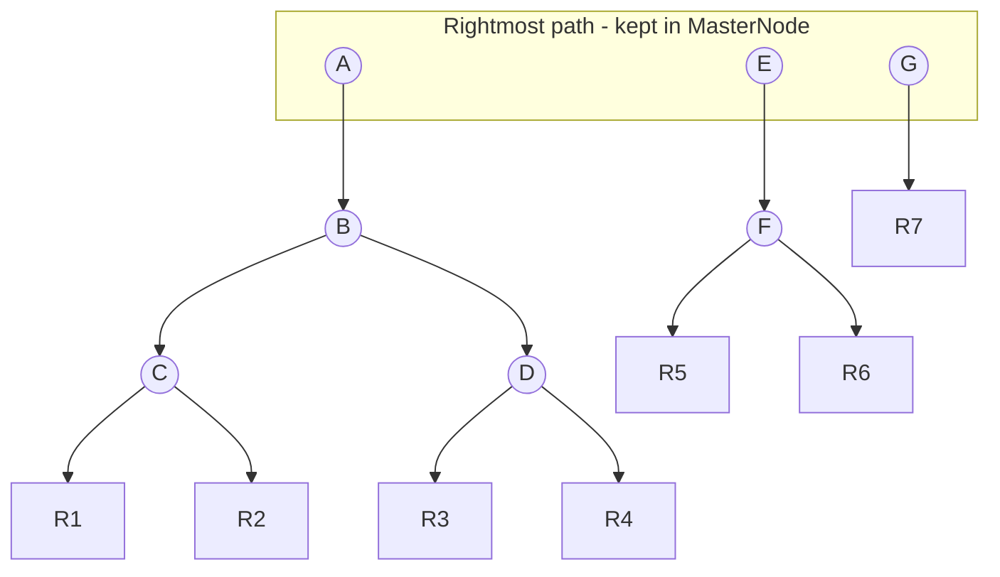

# Capture file design

## Transactions

Data that is added to a capture file is only available persistently after it is
committed. Uncommitted data can be read from the in-memory capture file object
to which the data was added.

A master node is used to track the current state of the file. To support
transactions, there are two MasterNode objects: a commit causes the current
MasterNode to be written and the alternate MasterNode to become current. The
current MasterNode is the one with the highest sequence number, which is kept in
the MasterNode itself. The sequence number wraps after 2³² commits so 0 is >
FFFFFFFF.

When written to disk, a master node is first converted to its binary
representation and preceded by zlib's crc32 of the binary data. This way, if a
failure occurs while writing a master node to disk, it can be detected on
recovery. Such an error could happen if, for example, the writing process was
terminated during the commit.

Master nodes are only written after all data included in the commit has been
written to the end of the capture file. If, on open, only one of the master
nodes is readable because there was a failure while writing the other node, the
good previous master node is used as the current master node. Although all data
that was written to the end of the file could still be there from the failed
commit, using the previous master node means that the old uncommitted data will
never be accessed and it will be overwritten with new commits.

## Master node structure

Each master node consists of:

- A first page containing:
  - [0:4] 4-byte CRC of rest of data (both pages)
  - [4:8] 4-byte serial number (should be other master node's serial number +/- 1)
    - This counter can wrap. All that matters is knowing which of the two master
      nodes was written to last.
  - [8:16] 8-byte file_limit
  - [16:20] 4-byte compression_block_len (indicates number of valid uncompressed
    bytes below)
  - [20:32] 12-byte metadata pointer (8-byte file position + 4-byte position in
    decompressed data). Default is 0 for both file position and position in
    decompressed data, which implies no metadata.
  - [32:36] 4-byte count of the total number of children (N) in the RightmostPath,
    followed by N occurrences of the following:
    - 1-byte height indicator (1=record, 2=bottom index node, etc).
    - 12-byte pointer (8-byte file position + 4-byte position in decompressed data)
- A second page containing:
  - The last (partial) committed page of data. It should be rewritten to the
    file at the indicated position during recovery. Subsequent writes will
    continue at file_limit, which is somewhere inside this page.
- A compression block of size compression_block_size containing
  compression_block_len of valid data.

## Overall file structure

|                   Start Position |  Default Value  | Description                                                                                          |
| ----------------------------------: | :-------------: | ---------------------------------------------------------------------------------------------------- |
|                                   1 | b'MioCapture\0' | Header bytes                                                                                         |
|                                  12 |        2        | Version (Long)                                                                                       |
|                                  16 |      4,096      | Page size (Long)                                                                                     |
|                                  20 |     32,768      | Compression Block size (Long)                                                                        |
|                                  24 |       32        | Fan out (Long)                                                                                       |
|                                     |                 | Unused                                                                                               |
|                               4,096 |                 | Master Node 1 (size = 2 x Page size + Compression bock size =  2 \* 4096 + 32768 = **40,960**) |
|  4,096 + 40,960  = **45,056** |                 | Master Node 2                                                                                        |
| 45,056 + 40,960  = **86,016** |                 | Data starts here                                                                                     |

Initial file size = 100 pages = 100 \* 4096 = 409,600 = 400KB

## Staging data

When binary data is added to the capture file, it is first written to the
compression block in memory. Once the compression block has
compression_block_size bytes or more of data, it is compressed.

For efficiency in writing to disk, the file is only written to in page-sized
(4KB) increments so that the last partial page of previously committed data,
which is kept in the second page of the master node if it is present, is written
out after where the last full page was written. The partial page will always
finish writing at the recorded file_limit.

The newly compressed block is then written out starting at file_limit up to the
last possible full page, with any remaining partial page being written to the
second page of the master node. After writing, the file_limit is incremented by
the length of the compressed data.

If the capture file is committed before the compression block is full, then the
partially-full compression block is written to the last section of the current
master node and its length is recorded in compression_block_len of the current
master node.

The position of the compression block in memory is considered to be at location
file_limit because that is where it will eventually be written out. This allows
us to use a consistent disk-oriented address for the start of the compression
block even though it is actually in memory.

## Record indexing

The location of records are tracked by a tree whose "RightmostPath" is kept in
the master node. The location of a record is a DataCoordinate composed of the
location in the file where the record's compression block was written and the
offset into the uncompressed data of the block where the record starts. As with
all variable length data stored in a capture file, a record is written with a
prefix indicating its size. For records the size prefix is an unsigned long.

### Example index tree with fanout 2

In this example, the index tree's nodes are labeled A through G and records are
labeled R1 to R7. The arrows are references of type DataCoordinate.

In the CaptureFile implementation, the rightmost path of the index tree is held
in the MasterNode such that the there is no direct reference from a rightmost
node to its rightmost child; instead, the rightmost child is simply the next
node in the rightmost path.

As records are added to the capture file, their locations are added to a node
with up to fan_out children.

Once a node becomes full, it is written to the end of the compression block as a
series of fan_out DataCoordinates. The now-persistent full node's DataCoordinate
is added to its parent. If the node was the root, then a new parent node is
created and this DataCoordinate is added to the new parent.

As a result, there is only ever one node, RightmostNode, that is not full per
level of the tree.

The RightmostPath of RightmostNodes is managed in memory and written to the
current master node on commit. All the children of all the RightmostNodes are
perfect sub-trees and are never modified after being written.

A RightmostNode does not directly refer to its child RightmostNode, since the
children are locations (DataCoordinates) and a RightmostNode will not have a
location until it is full and written out. Instead, the rightmost child can be
found in the RightmostPath at the parent's height - 1.

## Selection of default fan out

Our default fan_out is 32. Given that, one full "height 2" node refers to 32
"height 1" nodes, each of which refers to 32 records in the capture file. This
means one full "height 2" node refers to 32 x 32 = 1,024 actual records in the
capture file.

Following this pattern, we can see that just 8 levels can refer to 32⁸ (over 1
trillion) records. This means that finding an arbitrary record in a capture file
with 1 trillion records needs at most 8 seeks.

In memory, we only have to track one RightmostNode for each level. Since each
"starting location" is 8 bytes (start of compression block) + 4 bytes (position
in block) + 1 byte to store the level number, we have 32 x 13 = 416 bytes for
each full node.

This means that it takes 416x8=3,328 bytes to index 1 trillion records, which
easily fits into the end of the first page of the master node. (The master node
defaults to 4096 bytes in size, but only 4060 bytes are available since the
first 36 bytes are already in use.)

Since a full RightmostNode is never recorded in the MasterNode, the most bytes
it can ever need actually written to disk are 31 x 13 = 403 bytes. This means we
can store 10 levels of RightmostNodes in the available 4060 bytes of the
MasterNode. So the total number of records we can index with the default fan_out
of 32 and the default page_size of 4096 is: (31 x 32⁹) + (31 x 32⁸) ... + (31 x
32) + 31 = 1,125,899,906,842,623 records or over 1 quadrillion records.

The tree is stored with one RightmostNode from each level written to the master
node such that these nodes trace the path of the last write location. This means
all RightmostNodes can be modified and are in the master node, while all the
other nodes are full and never modified again.

The full nodes are all referenced by their parent node, but the "in-progress"
partially-full RightmostNodes are not, which is why they are kept in a list in
the MasterNode. They can be found simply because there is exactly one
RightmostNode per level, since there is only one in-progress partially-full node
per level.
